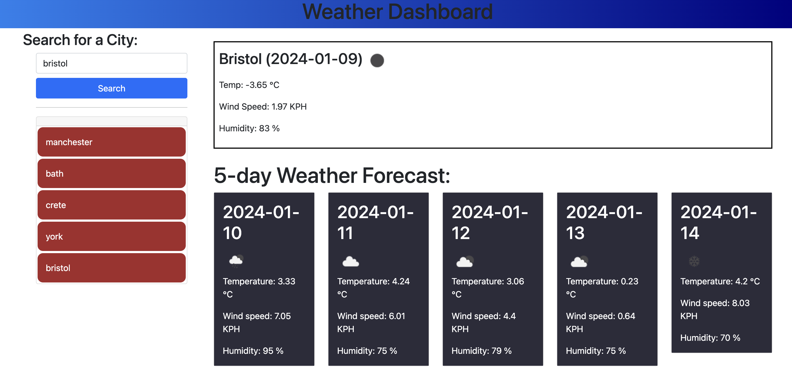

# weather-app

## Overview

This is a simple weather app that allows user to check the 5-day weather forcast for a specific city. A user can search for a city, view itas current weather conditions and forecast for the next 5 days. 

## Feature 

- **City Search:** Enter the name of the city in the search bar to get the current and 5 day forceast
- **History Search:** The app keeps track of the last 5 searched cities and display it. Users can click on the a city in the history to view its weather forcast conditions again.  
- **Responsive design:** The app is designed ot be responsive and works well on various devices. 

## Getting Started

1. Open the 'index.html' file in a web browser
2. Enter the name of the city in the search bar and click the "search" button to view the weather forecast. 

## Technologies used 
* HTML
* CSS
* JavaScript 
* JQuery 
* OpenWeatherMAp API

## Screenshot 

## Repository 
[A link to The Repository](https://github.com/omar12ahmed/weather-api)

## Live Project 

[A link to the Live Project](https://omar12ahmed.github.io/weather-api/)